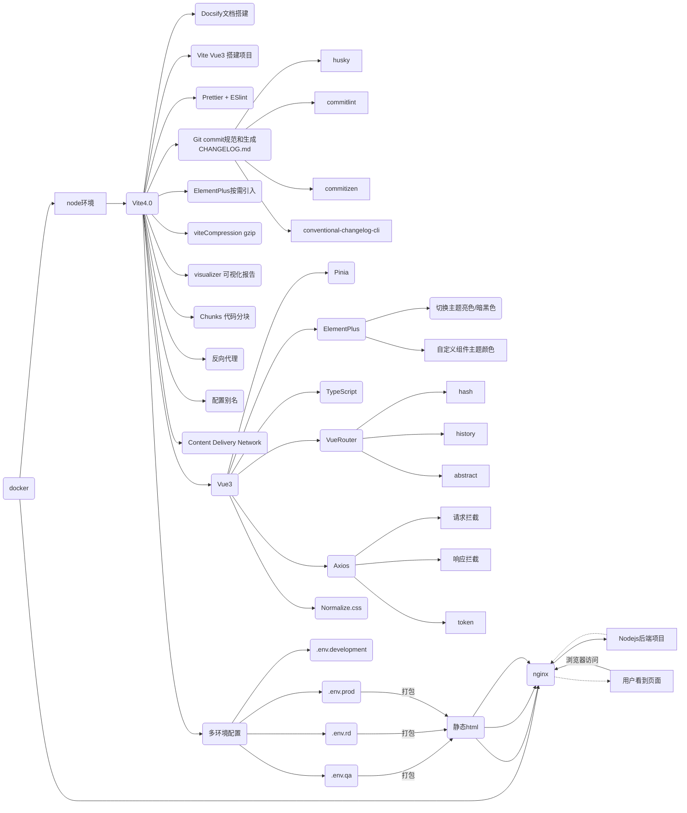
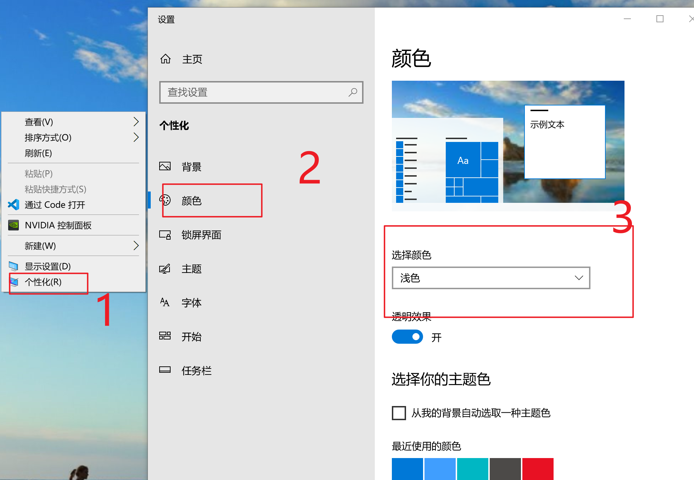

## **从 0 到 1 搭建一个脚手架**

Vite 必知必会从 0 到 1 搭建一个脚手架

## 一、课程技术栈

| 序号 | 技术         | 备注               |
| :--- | :----------- | :----------------- |
| 1    | vite4        | 打包优化           |
| 2    | vue3         |                    |
| 3    | vue-router   |                    |
| 4    | pinia        |                    |
| 5    | element-plus | 切换主题           |
| 6    | prettier     | 自动修复代码       |
| 7    | eslint       | 代码规范校验       |
| 8    | commmitlint  |                    |
| 9    | nodejs       | 提供后端接口       |
| 10   | docker       | 多阶段构建部署     |
| 11   | nginx        | 生产环境反向代理   |
| 12   | docsify      | 生成 markdown 文档 |

## 二、Vite 介绍

1. 官方文档介绍 https://cn.vitejs.dev/

2. 前端 Vite4 + Vue3 项目搭建打包和部署流程图



## 三、安装环境

需要安装环境

**vscode**

https://code.visualstudio.com/download

**git**

https://git-scm.com/downloads

**nodejs**

https://nodejs.org/zh-cn/

https://nodejs.org/dist/v18.14.1/node-v18.14.1.pkg

https://nodejs.org/dist/v18.14.1/node-v18.14.1-x64.msi

## 四、创建文档和 git 初始化项目

`docsify` 一个神奇的文档网站生成器。

https://docsify.js.org/#/quickstart

### 1. 初始化 docsify

```bash
shaohai.li@192 vite4-vue3-demo % npm i docsify-cli -g

shaohai.li@192 vite4-vue3-demo %
shaohai.li@192 vite4-vue3-demo % sudo npm i docsify-cli -g
Password:
/usr/local/bin/docsify -> /usr/local/lib/node_modules/docsify-cli/bin/docsify
+ docsify-cli@4.4.4
updated 1 package in 43.632s
shaohai.li@192 vite4-vue3-demo % docsify init ./docs


Initialization succeeded! Please run docsify serve ./docs

shaohai.li@192 vite4-vue3-demo % docsify serve docs

Serving /Users/shaohai.li/Desktop/vite4-vue3-demo/docs now.
Listening at http://localhost:3000

```

### 2. **git 初始化项目**

```bash
git init
```

### 3. **git 把代码加入到缓存区中**

```bash
git add .
```

### 3. **git commit 提交代码演示**

规范的 commit

```bash
git commit
```

### 4. docsify 支持 mermaid

https://docsify.js.org/#/markdown?id=supports-mermaid

```js
// Import mermaid
//  <link rel="stylesheet" href="//cdn.jsdelivr.net/npm/mermaid/dist/mermaid.min.css">
//  <script src="//cdn.jsdelivr.net/npm/mermaid/dist/mermaid.min.js"></script>

var num = 0;
mermaid.initialize({startOnLoad: false});

window.$docsify = {
  markdown: {
    renderer: {
      code: function (code, lang) {
        if (lang === 'mermaid') {
          return '<div class="mermaid">' + mermaid.render('mermaid-svg-' + num++, code) + '</div>';
        }
        return this.origin.code.apply(this, arguments);
      }
    }
  }
};
```

### 5. docsify 支持暗黑主题、离线查看

- 1. 拷贝 `docsify@4` 目录
- 2. 显示隐藏左侧菜单 `loadSidebar: false,`
- 3. index.html 替换

## 五、Vite 搭建项目

1. 初始化 vite

https://cn.vitejs.dev/

```bash
npm create vite@latest

Done. Now run:

  npm install
  npm run format
  npm run dev
```

2. 启动项目 - 安装依赖 - 指定淘宝镜像的方式安装

```bash
npm install --registry=https://registry.npm.taobao.org
```

3. 启动项目 - 开发环境

```bash
npm run dev
```

VSCode 安装 Volar

## 六、Prettier、ESlint

### (一)、什么是 Prettier

https://prettier.io/docs/en/index.html

### (二)、 什么是 ESlint

https://eslint.org/

1. 下面两段话来自于官网

> Find and fix problems in your JavaScript code
> ESLint statically analyzes your code to quickly find problems. It is built into most text editors and you can run ESLint as part of your continuous integration pipeline.

**使用 AI 翻译：**

> 找到并修复 JavaScript 代码中的问题
> ESLint 可以静态地分析您的代码，快速查找问题。它集成在大多数文本编辑器中，并且您可以将 ESLint 作为持续集成管道的一部分运行。

- **发现问题**

  ESLint 静态分析您的代码以快速发现问题。ESLint 内置于大多数文本编辑器中，您可以将 ESLint 作为持续集成管道的一部分运行。

- **自动修复问题**

  ESLint 发现的许多问题都可以自动修复。ESLint 修复是语法感知的，因此您不会遇到传统查找和替换算法引入的错误。

- **配置一切**

  预处理代码、使用自定义解析器并编写与 ESLint 的内置规则一起工作的您自己的规则。自定义 ESLint 以完全按照项目所需的方式工作。

### (三)、如何生成 ESlint 配置文件

https://eslint.org/play/

### (四)、prettier 和 eslint 的区别

Prettier 和 ESLint 是两种不同的代码检查工具。

Prettier 是一个代码格式化工具，它可以帮助你将代码重新排版，以符合一致的样式规则。它强制执行自己的代码格式化规则，而不考虑其他规则，例如 ESLint 的代码规范检查。

ESLint 是一个静态代码分析工具，它可以帮助你检查代码中潜在的问题并提供修复建议。它可以配置各种规则，用于检查代码是否符合特定的代码规范。

虽然 Prettier 可以解决一些代码格式问题，但它并不提供像 ESLint 那样的代码规范检查功能。如果你想要确保你的代码符合特定的代码规范，你可能需要同时使用 Prettier 和 ESLint。

### (五)、那么有了 eslint 为什么还需要 prettier，eslint 不是可以自动修复一些问题吗，prettier 相对于 eslint 最大的优点是什么

虽然 ESLint 可以自动修复一些问题，但是它通常只能修复那些符合特定规则的问题，而不是针对整个代码文件进行重新排版。而 Prettier 则是一款专门的代码格式化工具，它可以确保整个代码文件符合一致的样式规则，而不考虑其他规则。

Prettier 的最大优点是它具有非常强大的排版能力。它可以根据一些预定义的规则重新排版整个代码文件，让代码具有一致的格式和风格。这使得 Prettier 非常适合用于协作编程和维护大型代码库，因为它可以确保整个代码库的代码格式和风格是一致的。

另外，Prettier 的配置非常简单，只需要选择一些预定义规则或自定义规则即可。而 ESLint 的配置则比较复杂，需要选择各种不同的规则和插件，并对其进行配置。因此，Prettier 相对于 ESLint 来说，更加易于使用和配置。

### (六)、Vite Prettier 自动格式化代码

安装 Prettier

提交代码使用 prettier 自动格式化

https://prettier.io/docs/en/install.html

1. 安装 prettier

> 如果安装过 prettier 可以忽略一个步骤

```bash
npm install --save-dev --save-exact prettier
```

2. 创建`.prettierignore` 文件

```conf
# Logs
logs
*.log
npm-debug.log*
yarn-debug.log*
yarn-error.log*
pnpm-debug.log*
lerna-debug.log*

node_modules
.DS_Store
dist
dist-ssr
coverage
*.local

/cypress/videos/
/cypress/screenshots/

# Editor directories and files
.vscode/*
!.vscode/extensions.json
.idea
*.suo
*.ntvs*
*.njsproj
*.sln
*.sw?

.nojekyll

```

3. 创建 .prettierrc.json 文件

4. 给.prettierrc.json 填写配置

```json
{
  "arrowParens": "always", // 要求箭头函数参数用括号括起来。例如，`(x) => x + 1`
  "bracketSameLine": true, // 将对象的左括号放在同一行，而不是另起一行。
  "bracketSpacing": false, // 对象字面量的大括号之间不加空格
  "embeddedLanguageFormatting": "auto", // 是否启用嵌入语言的格式化规则，如HTML、Markdown等
  "htmlWhitespaceSensitivity": "css", // HTML文件空格敏感度，可以是"css"或"strict"
  "jsxSingleQuote": false, // 在JSX中使用单引号而不是双引号
  "printWidth": 120, // 每行最大字符数
  "proseWrap": "preserve", // 换行格式，可以是"preserve"或"always"
  "quoteProps": "as-needed", // 只在必要时为对象属性添加引号
  "insertPragma": false, // 插入Prettier的特殊注释来表明文件已被格式化过
  "requirePragma": false, // 要求在文件开头加上Prettier特殊的注释才会格式化文件
  "semi": true, // 是否在语句末尾添加分号
  "singleQuote": true, // 是否使用单引号而不是双引号
  "tabWidth": 2, // 缩进宽度
  "trailingComma": "none", // 数组、对象、函数等结尾是否添加逗号，可选值："none"、"es5"、"all"
  "useTabs": false, // 是否使用制表符进行缩进
  "vueIndentScriptAndStyle": false // 是否为Vue文件中的<script>和<style>标签缩进
}
```

5. 使用 npx prettier --write . 自动修复代码使其符合规范

6. 使用 npx prettier --check . 检查有哪些文件需要修复的

7. 安装 husky 和 ​​lint-staged：

```bash
npm install --save-dev husky lint-staged
npx husky install
npm pkg set scripts.prepare="husky install"
npx husky add .husky/pre-commit "npx lint-staged"
```

<p style="color:red">如果你执行`npx husky add .husky/pre-commit "npx lint-staged"`出现下面错误</p>

```bash
PS D:\Desktop\vite4-vue3-template> npx husky add .husky/pre-commit "npx lint-staged"
Usage:
  husky install [dir] (default: .husky)
  husky uninstall
  husky set|add <file> [cmd]
```

<p style="color:red">请你查看你的 Nodejs 版本，必须 18.12.1 才可以成功</p>

```bash
PS D:\Desktop\vite4-vue3-template> nvm use 18.12.1
Now using node v18.12.1 (64-bit)
PS D:\Desktop\vite4-vue3-template> node -v
v18.12.1
```

8. 将以下内容添加到您的 package.json：

```bash
{
  "lint-staged": {
    "**/*": "prettier --write --ignore-unknown"
  }
}
```

或者

```bash
{
  "lint-staged": {
    "**/*": "prettier --check --ignore-unknown"
  }
}
```

### (七)、 Vite git commit 不生效的问题 && Prettier 命令行介绍

1. 修改 package.json lint-staged

修改前

```json
{
  "lint-staged": {
    "**/*": "prettier --write --ignore-unknown"
  }
}
```

修改后

```json
{
  "lint-staged": {
    "**/*": "prettier --write ."
  }
}
```

2. Prettier 命令行介绍

https://prettier.io/docs/en/cli.html

3. 其他项目 `prettier --write --ignore-unknown` 生效

https://prettier.io/docs/en/cli.html#--ignore-unknown

## 七、 Vite Prettier + ESlint 自定义配置文件

### 1. VsCode 安装 prettier 插件

### 2. .eslintrc.cjs

```cjs
/* eslint-env node */
require('@rushstack/eslint-patch/modern-module-resolution');

module.exports = {
  root: true,
  extends: [
    'plugin:vue/vue3-essential',
    'eslint:recommended',
    '@vue/eslint-config-typescript',
    '@vue/eslint-config-prettier/skip-formatting'
  ],
  rules: {
    // 指定规则
    'vue/no-parsing-error': [
      // 禁止Vue.js错误
      2, // 错误级别为error
      {
        'x-invalid-end-tag': false // x-invalid-end-tag这个错误不会报错
      }
    ],
    'no-regex-spaces': 'error', // 禁止正则表达式中的空格
    'no-multi-spaces': 'error', // 禁止多个空格
    'array-bracket-spacing': [
      // 数组方括号内的空格
      'error',
      'never'
    ],
    'object-curly-spacing': [
      // 对象花括号内的空格
      'error',
      'never'
    ],
    'block-spacing': [
      // 代码块花括号内的空格
      'error',
      'never'
    ],
    'comma-spacing': [
      // 逗号后面的空格
      'error',
      {
        before: false, // 逗号前没有空格
        after: true // 逗号后有空格
      }
    ],
    'semi-spacing': [
      // 分号后面的空格
      'error',
      {
        before: false, // 分号前没有空格
        after: true // 分号后有空格
      }
    ],
    'computed-property-spacing': [
      // 计算属性内部的空格
      'error',
      'never'
    ],
    'no-trailing-spaces': 'off', // 禁止行末有空格，但是不作为错误级别
    'no-spaced-func': 'error', // 禁止函数名和括号之间有空格
    'space-before-function-paren': [
      // 函数括号前的空格
      'error',
      {
        anonymous: 'ignore', // 匿名函数括号前忽略
        named: 'ignore' // 命名函数括号前忽略
      }
    ],
    'space-before-blocks': [
      // 代码块括号前的空格
      'error',
      'always'
    ],
    'space-in-parens': [
      // 括号内的空格
      'error',
      'never'
    ],
    'space-infix-ops': [
      // 操作符中的空格
      'error',
      {
        int32Hint: false // 指定是否在位运算符号前后插入空格
      }
    ],
    'space-unary-ops': 'error', // 一元运算符前后不留空格
    'spaced-comment': ['error', 'always'], // 注释前后留一个空格
    'arrow-spacing': 'error', // 箭头函数的箭头前后留一个空格
    'yield-star-spacing': [
      // yield* 后面不留空格，前面留一个空格
      'error',
      {
        before: true,
        after: false
      }
    ],
    'no-irregular-whitespace': 'error', // 禁止使用不规则的空白符
    'template-curly-spacing': ['error', 'never'], // 模板字符串内部不留空格
    'max-len': ['error', 120], // 单行最大长度为120
    'no-multiple-empty-lines': 'error', // 不允许多个空行
    'eol-last': 'off', // 不强制文件末尾有空行
    'lines-around-comment': [
      // 注释前后各保留一行空行
      'error',
      {
        beforeBlockComment: false
      }
    ],
    curly: ['error', 'multi-line'], // 单行代码块两侧不加空格，多行代码块两侧加空格
    camelcase: [
      // 使用驼峰命名法，但是属性名可以不用
      'error',
      {
        properties: 'never'
      }
    ],
    'no-unused-vars': 0, // 允许定义未使用的变量
    'arrow-parens': 0, // 箭头函数参数可以不用括号
    indent: [
      // 使用2个空格作为一个缩进层级
      'error',
      2,
      {
        SwitchCase: 1 // switch 语句中的 case 子句增加一个缩进层级
      }
    ],
    'no-console': 0, // 允许使用 console
    'generator-star-spacing': 0, // generator 函数的 * 号前后不留空格
    'no-var': 1, // 尽量使用 let 或 const，不使用 var
    eqeqeq: ['error', 'smart'], // 使用严格相等运算符（===）或不严格相等运算符（==）的情况下需要进行类型转换时可以使用 ==，例如将字符串转为数字
    semi: [1, 'always'], // 语句末尾必须加分号，但可以使用 ASI 自动插入分号
    'operator-linebreak': [
      // 在操作符前换行，除非操作符位于行末或者下一行开头
      2,
      'before',
      {
        overrides: {
          '?': 'after'
        }
      }
    ],
    'no-debugger': 2, // 禁止使用 debugger
    quotes: [1, 'single'] // 字符串必须使用单引号
  },
  parserOptions: {
    ecmaVersion: 'latest'
  }
};
```

### 3. `.prettierrc.cjs`

`.prettierrc.json`修改为 `.prettierrc.cjs`

`.prettierrc.cjs` 内容如下

```cjs
module.exports = {
  // 使用 prettier 的配置 schema。
  $schema: 'https://json.schemastore.org/prettierrc',

  // 将箭头函数的参数始终用括号包裹起来。
  arrowParens: 'always',

  // 在同一行中书写对象大括号和数组大括号。
  bracketSameLine: true,

  // 在对象大括号内不添加空格。
  bracketSpacing: false,

  // 根据需要自动格式化嵌入式语言，如在模板字符串中的 JavaScript 代码。
  embeddedLanguageFormatting: 'auto',

  // HTML 空格敏感性使用 css。
  htmlWhitespaceSensitivity: 'css',

  // 不使用单引号而是使用双引号来包裹 JSX 属性。
  jsxSingleQuote: false,

  // 设置每行的字符数限制，超过则格式化。
  printWidth: 120,

  // 不在 markdown 文件中强制断行。
  proseWrap: 'preserve',

  // 只有在必要时才将属性名称用引号包裹起来，例如包含空格或保留关键字的属性名。
  quoteProps: 'as-needed',

  // 不插入任何格式化代码，例如 Prettier 的特殊注释。
  insertPragma: false,

  // 不要在格式化的文件中要求使用特殊注释。
  requirePragma: false,

  // 在语句末尾添加分号。
  semi: true,

  // 使用单引号而不是双引号。
  singleQuote: true,

  // 设置一个 tab 的宽度。
  tabWidth: 2,

  // 不在多行的末尾添加逗号。
  trailingComma: 'none',

  // 使用空格而不是制表符来缩进。
  useTabs: false,

  // 不缩进 .vue 文件中的 <script> 和 <style> 标签。
  vueIndentScriptAndStyle: false
};
```

### 4. 如何配置.prettierrc.cjs

https://prettier.io/playground/

### 5. 创建 .eslintignore 配置文件

1. .eslintignore 文件内容如下

```.eslintignore
# Logs
logs
*.log
npm-debug.log*
yarn-debug.log*
yarn-error.log*
pnpm-debug.log*
lerna-debug.log*

node_modules
.DS_Store
dist
dist-ssr
coverage
*.local

/cypress/videos/
/cypress/screenshots/

# Editor directories and files
.vscode/*
!.vscode/extensions.json
.idea
*.suo
*.ntvs*
*.njsproj
*.sln
*.sw?

# 文档文件
docs/docsify@4

.husky

*d.ts

```

2. 使用 npm run lint 自动修复

3. <p>解决vue svg图标组件问题</p>

.eslintignore 增加如下规则

```.eslintignore
/src/components/icons/
```

### 6. git commit 之前先进行 eslint 校验和自动修复

1. 修改 .husky pre-commit

```bash
#!/usr/bin/env sh
. "$(dirname -- "$0")/_/husky.sh"

npm run lint
```

以上内容的意思是，在代码提交前运行 lint。

2. 删掉 `package.json` `lint-staged` 配置项

```json
"lint-staged": {
 "**/*": "prettier --check ."
}
```

## 八、git commit 规范生成

### 1. 介绍 Git Commit 规范

当涉及到 Git Commit 规范时，Angular 的规范是最常被引用的。Angular 的规范被广泛使用，因为它提供了一套清晰而详细的指南，涵盖了 Git Commit 中的各种方面。

下面我们来逐一解释 Angular 的 Git Commit 规范：

1. **格式**

每个提交信息由三个部分组成：`Header`、`Body`和`Footer`。其中，`Header`是必须的，`Body`和`Footer`是可选的。

`Header` 由一个类型和一个主题组成，格式如下：

```bash
<type>(<scope>): <subject>
```

- type：提交的类型，表示代码变动的性质，必须是下列之一：

  - feat：新功能（feature）
  - fix：修复 bug
  - docs：文档更新
  - style：代码格式化
  - refactor：重构
  - test：测试用例更新
  - chore：构建或辅助工具更新

- scope：提交影响的范围，可以是任何相关的模块或组件。如果没有特定的范围，可以省略此部分。

- subject：提交的简短描述，不超过 50 个字符。

Body 是一个可选的长文本，包含详细的修改说明和上下文信息。

Footer 是一个可选的注释，用于引用关闭的 Issue 或相关的 PR 等。

2. **示例**

下面是一个符合 Angular 规范的提交示例：

```bash
feat(search): add fuzzy search

- add fuzzy search feature to search component
- update search component tests

Closes #123
```

其中，该提交的类型是 `feat`，范围是 `search`，主题是 “add fuzzy search” 。Body 部分提供了更详细的信息，Footer 部分引用了一个关闭的 `Issue #123`。

3. **提交信息的好处**

Angular 的 Git Commit 规范旨在提高代码的可维护性和可读性。通过遵循这个规范，团队成员可以更容易地了解每个提交的用途和范围，并更好地跟踪代码的历史记录。此外，它还可以帮助提高团队成员之间的沟通和协作效率，减少重复劳动和不必要的问题。

对于 Git 小白来说，遵循 Angular 的 Git Commit 规范可能有些繁琐，但这是一个非常好的实践，可以帮助你写出更好的提交信息，提高协作效率。建议在学习 Git 的同时，学习 Git Commit 规范，提高自己的 Git 技能。

### 2. 实现 Git Commit 规范步骤

1. 提交规范：使用标准的 Git commit 消息格式可以使您的提交更具可读性，并有助于其他人更好地理解您的提交意图。

可以使用工具如 commitizen、commitlint 等来帮助您在提交时规范化消息格式，并在不符合规范时阻止提交。

2. 自动化生成 Changelog：自动生成 Changelog 可以极大地减少手动管理版本历史记录所需的工作量。可以使用像 Conventional Changelog 这样的工具，自动从 Git 提交记录中生成 Changelog。

3. 发布版本：在将新版本发布到仓库时，建议在提交信息中标记版本号。可以使用语义化版本号，如 v1.0.0 来标记版本。发布时，可以将 Changelog 和版本号一起打包发布。

以上是一些基本的步骤，可用于在您的项目中实现 Git commit 规范和自动生成 Changelog。

### 3. 使用 commitlint 来强制校验你的 commit

https://github.com/conventional-changelog/commitlint

在 Vite4+Vue3+ESLint+Prettier+Commitlint 项目中，可以使用 Git 钩子来限制它们的使用。

Git 钩子可以在 Git 操作发生时触发自定义脚本，例如提交代码前运行测试或格式化代码。

以下是一些常用的 Git 钩子以及如何在项目中使用它们：

**commit-msg 钩子**

commit-msg 钩子可以在提交代码时检查提交信息的格式是否符合要求，例如检查提交信息是否包含了对应的 Issue 编号或是否符合特定的格式。
在使用 commit-msg 钩子之前，需要安装一个 Git 消息验证工具，例如 commitlint。

1. 在项目根目录下执行以下命令安装 commitlint：

```bash
npm install @commitlint/cli @commitlint/config-conventional --save-dev
```

2. 安装完成后，在根目录下创建`commitlint.config.js`文件，并添加以下内容：

使用官方 github 生成的需要

(1)`选择编码` - `通过编码保存`

(2)`选择行尾序列` - `LF`

```javascript
// eslint-disable-next-line no-undef
module.exports = {
  extends: ['@commitlint/config-conventional']
};
```

以上内容的意思是，使用`@commitlint/config-conventional`规则来验证提交信息的格式。

3. 然后，在.husky 文件中拷贝`pre-commit`,拷贝后将名称修改为`commit-msg`,添加以下内容：

> `npx husky add .husky/commit-msg  'npx --no -- commitlint --edit $1`

```bash
#!/usr/bin/env sh
. "$(dirname -- "$0")/_/husky.sh"

npx --no -- commitlint --edit $1
```

以上内容的意思是，在提交代码时使用 commitlint 验证提交信息的格式。

以上是使用 Git 钩子限制 Vite4+Vue3+ESLint+Prettier+Commitlint 项目的常用方法，可以根据实际情况进行修改和调整。

### 4. 使用 commitizen 工具生成 commit 消息

> 如果已经熟练晓得如何提交代码 - 可以不用它

https://github.com/commitizen/cz-cli

```bash
npm install -g commitizen
```

```bash
commitizen init cz-conventional-changelog --save-dev --save-exact
```

```bash
npm install --save-dev commitizen
```

```json
  "scripts": {
    "commit": "cz"
  }
```

```bash
npm run commit
```

### 5. 生成 CHANGELOG 文件

https://github.com/conventional-changelog/conventional-changelog/tree/master/packages/conventional-changelog-cli

```bash
npm install -g conventional-changelog-cli
```

```bash
conventional-changelog -p angular -i CHANGELOG.md -s
```

```json
{
  "scripts": {
    "changelog": "conventional-changelog -p angular -i CHANGELOG.md -s -r 0"
  }
}
```

```json
{
  "scripts": {
    "version": "conventional-changelog -p angular -i CHANGELOG.md -s && git add CHANGELOG.md"
  }
}
```

**这个命令如果我不希望使用 angular 规范怎么修改**

如果您不想使用 Angular 生成 changelog，您可以替换 -p angular 参数为您想要使用的其他预设或自定义配置文件。conventional-changelog 支持以下预设：

```
angular
atom
codemirror
ember
eslint
express
jquery
jshint
jscs
karma
protractor
typescript
unreleased
```

```bash
conventional-changelog -p typescript -i CHANGELOG.md -w -r 0
```

如果您想使用自定义配置文件，则可以使用 -p 参数后面跟一个指向您的自定义配置文件的路径。例如，如果您的自定义配置文件在当前目录中的 myconfig.js 文件中，则命令应如下所示：

```bash
conventional-changelog -p ./myconfig.js -i CHANGELOG.md -w -r 0
```

注意，您需要根据自己的需求自定义配置文件，并按照 conventional-changelog 的文档编写该文件，以确保正确生成 changelog。

### 6. release-please (不讲)

> `standard-version` 已经被废弃 建议使用 `release-please`

https://www.npmjs.com/package/standard-version

https://github.com/googleapis/release-please

### 7. 参考文章

https://zhuanlan.zhihu.com/p/458100292

https://github.com/vitejs/vite/blob/main/packages/vite/CHANGELOG.md

## 九、Vite Normalize.css 简介及详解、使用和引入 resetcss 对比-删除默认组件、样式

不错的文章博客 https://blog.csdn.net/u013946061/article/details/108302849

reset css https://meyerweb.com/eric/tools/css/reset/

normalize.css https://www.npmjs.com/package/normalize.css/v/5.0.0

https://ffffee.com/#/frontend/230216-reset.css-vs-normalize.css.md

在使用 Vite 脚手架创建的 Vue 3 项目中引入 normalize.css，可以按照以下步骤进行：

### 1. 安装 normalize.css 可以使用 npm 或 yarn 安装 normalize.css，执行以下命令：

```bash
npm install --save normalize.css
```

### 2. 在 main.js 中引入 normalize.css 在 main.js 中引入 normalize.css，以便在全局范围内应用：

```js
import {createApp} from 'vue';
import App from './App.vue';
import 'normalize.css/normalize.css'; // 引入 normalize.css
createApp(App).mount('#app');
```

### 3. 删掉多余的组件代码

### 4. Vue 组件开发规范介绍

### 5. 引入 reset css 对比

- （1）解决 reset css 对于一些样式的误伤
- （2）对于富文本编辑器不友好

## 十、Vite 支持 scss 预处理器

1. 给 assets/base.css 增加下面代码

```css
html,
body {
  margin: 0;
  padding: 0;
}
```

2. 在 HomeView.vue 使用 scss 语法

```html
<template>
  <main class="home-container">home</main>
</template>

<script setup lang="ts"></script>

<style lang="scss" scoped>
  .home-container {
    height: 100vw;
    overflow-x: hidden;
    overflow-y: auto;
  }
</style>
```

<p style="color:red;">此时会抛出错误</p>

3. 安装 sass 预处理器

https://cn.vitejs.dev/guide/features.html#css-pre-processors

```bash
npm add -D sass
```

<p style="color:blue;">错误消息 可以正确处理 scss 语法的css</p>

## 十一、Vue Router 介绍

简单案例介绍

https://router.vuejs.org/zh/introduction.html

1. 介绍 useRoute/useRouter 和 hash/history/abstract

https://ffffee.com/#/frontend/230220-%E9%9D%A2%E8%AF%95%E7%BB%8F%E9%AA%8C%E5%88%86%E4%BA%AB-%E7%9C%9F%E9%A2%98-%E7%AD%94%E6%A1%88?id=vue-%e8%b7%af%e7%94%b1%e9%83%bd%e6%9c%89%e5%87%a0%e7%a7%8d%e6%a8%a1%e5%bc%8f

2. router/index.ts

```js
import {createRouter, createWebHistory} from 'vue-router';
import HomeView from '../views/HomeView.vue';

const router = createRouter({
  history: createWebHistory(import.meta.env.BASE_URL),
  routes: [
    {
      path: '/',
      name: 'home',
      component: HomeView
    },
    {
      path: '/about',
      name: 'about',
      // route level code-splitting
      // this generates a separate chunk (About.[hash].js) for this route
      // which is lazy-loaded when the route is visited.
      component: () => import('../views/AboutView.vue')
    },
    {
      path: '/log/:logId',
      name: 'log',
      component: () => import('../views/LogView.vue')
    }
  ]
});

export default router;
```

3. App.vue

```vue
<script setup lang="ts">
import {RouterLink, RouterView} from 'vue-router';
</script>

<template>
  <RouterLink to="/">home</RouterLink>
  <RouterLink to="/about">about</RouterLink>
  <!-- <RouterLink to="/log/1234">log</RouterLink> -->
  <RouterView />
</template>

<style scoped></style>
```

4. views/LogView.vue

```vue
<template>
  <main class="log-container">
    <h1>log</h1>
    <p>{{ logId }}</p>
  </main>
</template>

<script setup lang="ts">
import {useRoute} from 'vue-router';
import {ref, onMounted} from 'vue';

const logId = ref<string>('');

onMounted(() => {
  const route = useRoute();

  logId.value = String(route.params.logId);

  console.log(route);
});
</script>

<style lang="scss" scoped>
.log-container {
  height: 100vw;
  overflow-x: hidden;
  overflow-y: auto;
}
</style>
```

5. views/HomeView.vue

```vue
<template>
  <main class="home-container">
    <h1>home</h1>

    <button @click="onClickLog">跳转到log页面</button>
  </main>
</template>

<script setup lang="ts">
import {useRouter} from 'vue-router';

const router = useRouter();
function onClickLog() {
  router.push({path: `/log/${Math.random().toString().slice(2)}`});
}
</script>

<style lang="scss" scoped>
.home-container {
  height: 100vw;
  overflow-x: hidden;
  overflow-y: auto;
}
</style>
```

6. 修复 类型错误

router/index.ts

<p style="color:red;">类型“ImportMeta”上不存在属性“env”。ts(2339)</p>

https://github.com/vitejs/vite/pull/5835#issuecomment-1311244502

解决办法，在 tsconfig.json 添加下面内容

```json
{
  "compilerOptions": {
    "types": ["vite/client"]
  }
}
```

## 十二、Pinia 介绍

简单案例介绍

https://pinia.vuejs.org/zh/

## 十三、多环境打包

`"build": "run-p type-check build-only", `这个是什么意思

```
这段代码是一个 NPM script，它使用 npm-run-all 包中的 run-p 命令同时运行两个脚本命令：type-check 和 build-only。这里的 type-check 命令使用了 vue-tsc 工具来进行 TypeScript 类型检查，而 build-only 命令使用 vite build 命令来构建项目。

因此，运行 npm run build 命令将同时运行这两个命令。首先，type-check 命令将执行 TypeScript 类型检查，如果存在类型错误，则会抛出一个错误并停止构建进程。如果类型检查通过，则会继续运行 build-only 命令，这将构建你的项目并生成静态文件，以便在生产环境中使用。

使用这种方式可以在构建项目之前先进行类型检查，以确保项目代码的类型正确性，从而减少运行时错误的出现。同时，将两个命令放在一个 run-p 命令中并行运行，可以加快构建时间，提高开发效率。
```

在配置中使用环境变量 https://cn.vitejs.dev/config/#using-environment-variables-in-config

多环境配置根据命令打包出来不同的目录包

https://cn.vitejs.dev/guide/env-and-mode.html

package.json

```json
"scripts": {
    "prod": "run-p type-check build-prod",
    "rd": "run-p type-check build-rd",
    "qa": "run-p type-check build-qa",
    "build-prod": "vite build --mode prod",
    "build-rd": "vite build --mode rd",
    "build-qa": "vite build --mode qa",
  },
```

.env.development

```conf
NODE_ENV=development
```

.env.rd

```conf
NODE_ENV=production
```

.env.qa

```conf
NODE_ENV=production
```

.env.prod

```conf
NODE_ENV=production
```

vite.config.ts

https://cn.vitejs.dev/config/build-options.html#build-outdir

```js
  build: {
    outDir: process.env.MODE || 'dist'
  },

```

运行打包命令

```bash
# 联调
npm run rd
# 测试
npm run qa
# 生产｜线上环境
npm run prod
```

修改这三个文件的配置 .gitignore .prettierignore .eslintignore

```.gitignore
/qa
/rd
/prod
```

## 十四、utils request axios 请求拦截响应拦截

https://axios-http.com/zh/docs/interceptors

```bash
npm install axios --save
```

@/utils/request.ts

```ts
/**
 * @file request
 * @description 封装 Axios 请求库
 * @module utils/request
 */

import axios from 'axios';

// Axios 实例
const service = axios.create({
  baseURL: import.meta.env.VITE_BASE_URL, // url = base url + request url
  // `withCredentials` 表示跨域请求时是否需要使用凭证
  withCredentials: false, // 默认的
  // withCredentials: true, // send cookies when cross-domain requests
  timeout: 1000 * 60 // request timeout
});

// 请求拦截  设置统一 header
service.interceptors.request.use(
  (config) => {
    // const userToken = localStorage.getItem('userToken', userToken);
    // if (userToken) {
    //     config.headers['Authorization'] = userToken;
    // }
    return config;
  },
  (error: any) => {
    return Promise.reject(error);
  }
);

// 响应拦截  401 token过期处理
service.interceptors.response.use(
  (response) => {
    return response;
  },
  (error: any) => {
    return Promise.reject(error);
  }
);

export default service;
```

@/apis/roles.ts

```ts
/**
 * @file 系统管理 => 角色管理 api
 * @description 程序员李钟意
 */

import request from '@/utils/request';

// 角色管理 => 获取用户列表
export function getRoles(params: Record<string, unknown> = {}): Promise<any> {
  return request({method: 'get', url: '/api/roles/', params});
}

// 角色管理 => 根据角色id获取用户权限
export function getRolesByIdPermission(roleId: number): Promise<any> {
  return request({method: 'get', url: `/api/roles/${roleId}/`});
}

// 角色管理 => 添加用户
export function postRoles(data: any): Promise<any> {
  return request({method: 'post', url: '/api/roles/', data});
}

// 角色管理 => 修改用户
export function putRoles(id: number, data: any): Promise<any> {
  return request({method: 'put', url: `/api/roles/${id}/`, data});
}

// 角色管理 => 删除用户
export function deleteRoles(id: number): Promise<any> {
  return request({method: 'delete', url: `/api/roles/${id}/`});
}
```

https://jsonplaceholder.typicode.com/todos/

**使用一个例子演示如何使用这个封装的请求库**

1. 创建`todos.ts`

```ts
/**
 * @file 系统管理 => 角色管理 api
 * @author 程序员李钟意
 */

import request from '@/utils/request';

export type TodoItem = {
  userId: number;
  id: number;
  title: string;
  completed: boolean;
};

export function getTodos(params: Record<string, unknown> = {}): Promise<{data: TodoItem[]}> {
  return request({method: 'get', url: '/todos/', params});
}

export function postTodos(data: any): Promise<any> {
  return request({method: 'get', url: '/todos/', data});
}
```

2. 修改 HomeView.vue 组件

内容如下

```vue
<template>
  <main class="home-container">
    <h1>home</h1>

    <button @click="onClickLog">跳转到log页面</button>

    <ul class="todos-wrap">
      <li v-for="todo in todos" :key="todo.id" class="todo-item">
        <span>{{ todo.userId }}</span
        >, <span>{{ todo.id }}</span
        >, <span>{{ todo.title }}</span
        >,
        <span>{{ todo.completed }}</span>
      </li>
    </ul>
  </main>
</template>

<script setup lang="ts">
import {getTodos, type TodoItem} from '@/apis/todos';
import {useRouter} from 'vue-router';
import {ref, onMounted} from 'vue';

const router = useRouter();
function onClickLog() {
  router.push({path: `/log/${Math.random().toString().slice(2)}`});
}

const todos = ref<TodoItem[]>([]);

onMounted(() => {
  getTodos().then((response: {data: TodoItem[]}) => {
    console.log('data', response.data);
    todos.value = response.data;
  });
});
</script>

<style lang="scss" scoped>
.home-container {
  height: 100vw;
  overflow-x: hidden;
  overflow-y: auto;
}
</style>
```

## 十五、配置反向代理

### Vite 配置

https://cn.vitejs.dev/config/server-options.html#server-proxy

```ts
  server: {
    proxy: {
      // 带选项写法：http://localhost:5173/api/todos -> http://jsonplaceholder.typicode.com/todos
      '/api': {
        target: 'http://jsonplaceholder.typicode.com',
        changeOrigin: true,
        // logLevel: 'debug', // 日志级别，设置为debug
        rewrite: (path) => path.replace(/^\/api/, '')
      }
    }
  },
```

### **Nodejs 例子**

1. 初始化

```bash
npm init -y
```

2. 安装模块

```bash
npm i cors express nodemon --save
```

https://www.npmjs.com/package/express

index.js

```js
const express = require('express');
const app = express();

app.get('/', function (req, res) {
  res.send('Hello World');
});

app.listen(3000);
```

3. 引入跨域资源共享

https://www.npmjs.com/package/cors

```js
app.use(cors());
```

4. 返回数据

todos.json

https://jsonplaceholder.typicode.com/todos/

## 十六、添加 element-plus 组件库、按需引入配置

1. 官网文档

   https://element-plus.gitee.io/zh-CN/guide/installation

2. 安装 element-plus

```bash
npm install element-plus --save
```

3. 如果您使用 Volar，请在 tsconfig.json 中通过 compilerOptions.type 指定全局组件类型。

```json
// tsconfig.json
{
  "compilerOptions": {
    // ...
    "types": ["element-plus/global"]
  }
}
```

4. 完整引入

```ts
import ElementPlus from 'element-plus';
import 'element-plus/dist/index.css';

const app = createApp(App);

app.use(ElementPlus);
```

5. 按需引入

安装模块

```bash
npm install -D unplugin-vue-components unplugin-auto-import
```

修改 vite.config.ts

```ts
// vite.config.ts
import {defineConfig} from 'vite';
import AutoImport from 'unplugin-auto-import/vite';
import Components from 'unplugin-vue-components/vite';
import {ElementPlusResolver} from 'unplugin-vue-components/resolvers';

export default defineConfig({
  // ...
  plugins: [
    // ...
    AutoImport({
      resolvers: [ElementPlusResolver()]
    }),
    Components({
      resolvers: [ElementPlusResolver()]
    })
  ]
});
```

删掉 node_modules 重新 npm install，重新启动项目

```bash
npm run dev
```

对比按需引入和全部引入打包后的文件大小

## 十七、自定义主题、暗黑模式（切换主题 - 浅色/深色）、自定义命名空间

https://element-plus.gitee.io/zh-CN/guide/theming.html

### 1. 自定义主题

https://element-plus.gitee.io/zh-CN/guide/theming.html

创建 src/styles/index.scss 文件内容如下

```scss
@forward 'element-plus/theme-chalk/src/common/var.scss' with (
  $colors: (
    'primary': (
      'base': green
    )
  )
);
// 如果只是按需导入，则可以忽略以下内容。
// 如果你想导入所有样式:
@use 'element-plus/theme-chalk/src/index.scss' as *;
```

### 2. **暗黑模式**

https://element-plus.gitee.io/zh-CN/guide/dark-mode.html

#### (1) 如何修改系统主题

- Windows10 系统 - 鼠标右键 - 个性化 - 颜色 - 选择颜色 - 选择浅色/深色

  
  <!--  -->

- MacOS - 系统偏好设置 - 外观 - 浅色/深色

---

#### (2) **实现原理**

监听系统主题变化 - 自动切换主题

```vue
<script setup lang="ts">
import {onMounted, onUnmounted, ref} from 'vue';
import {toggleDark} from '@/composables';

const matchMediaObj = window.matchMedia('(prefers-color-scheme: dark)');

const onChangeMedia = (event: MediaQueryListEvent) => {
  const newTheme = event.matches ? 'dark' : 'light';
  toggleDark(newTheme === 'dark');
};

onMounted(() => {
  // 监听系统主题变化
  matchMediaObj.addEventListener('change', onChangeMedia);
});

onUnmounted(() => {
  matchMediaObj.removeEventListener('change', onChangeMedia);
});
</script>

<template>
  <main>hello 李钟意</main>
  <div class="button-group">
    <el-button plain @click="toggleDark()">切换主题</el-button>
  </div>
</template>
```

#### (3) 实现暗黑模式官方例子

ElementPlus 暗黑色模式 https://element-plus.gitee.io/zh-CN/guide/dark-mode.html

ElementPlus 提供的例子 https://github.com/element-plus/element-plus-vite-starter

#### (4) **`color-scheme: dark`是什么意思**

MDN color-scheme https://developer.mozilla.org/en-US/docs/Web/CSS/color-scheme

```css
html {
  color-scheme: dark;
}
```

这段代码是一段 CSS 代码，用于设置 HTML 文档的颜色方案（color scheme）为暗色模式（dark mode）。

在 CSS 中，color-scheme 属性用于指定文档中使用的颜色方案。dark 值表示使用暗色模式，即深色背景和浅色文本的配色方案。除此之外，还可以使用 light 值表示亮色模式，即浅色背景和深色文本的配色方案。

通过设置 color-scheme 属性，可以使文档自动适应用户所使用的系统颜色方案，提供更好的可访问性和用户体验。如果用户的系统设置为暗色模式，那么文档会自动使用暗色模式的颜色方案，反之亦然。

#### (5) **实现步骤**

1. 把`src/styles/`,`src/composables/`目录拷贝过来

2. main.ts 中引入

```ts
import '@/styles/index.scss';
```

3. App.vue 引入命名空间

```vue
<script setup lang="ts">
import {RouterLink, RouterView} from 'vue-router';
</script>

<template>
  <el-config-provider namespace="ep">
    <header>
      <nav>
        <RouterLink to="/">Home</RouterLink>
        <RouterLink to="/about">About</RouterLink>
      </nav>
    </header>
    <RouterView />
  </el-config-provider>
</template>

<style scoped></style>
```

4. vite.config.ts 修改如下

```ts
export default defineConfig(({command, mode}) => {
  // 根据当前工作目录中的 `mode` 加载 .env 文件
  // 设置第三个参数为 '' 来加载所有环境变量，而不管是否有 `VITE_` 前缀。
  const env = loadEnv(mode, process.cwd(), '');
  return {
    // ...
    plugins: [
      vue(),
      vueJsx(),
      AutoImport({
        resolvers: [ElementPlusResolver()]
      }),
      Components({
        extensions: ['vue', 'md'],
        // allow auto import and register components used in markdown
        include: [/\.vue$/, /\.vue\?vue/, /\.md$/],
        resolvers: [
          ElementPlusResolver({
            importStyle: 'sass'
          })
        ],
        dts: 'src/components.d.ts'
      })
    ],
    css: {
      preprocessorOptions: {
        scss: {
          additionalData: '@use "@/styles/element/index.scss" as *;'
        }
      }
    }
  };
});
```

5. 组件中使用

```vue
<script setup lang="ts">
import {toggleDark} from '@/composables';
</script>

<template>
  <main>hello 李钟意</main>
  <div class="button-group">
    <el-button plain @click="toggleDark()">切换主题</el-button>
  </div>
</template>
```

### 3. **自定义命名空间**

https://element-plus.gitee.io/zh-CN/guide/namespace.html

切换主题颜色的时候如果没有修改这里 会不生效

1. 修改 App.vue

```vue
<el-config-provider namespace="ep">
  <RouterView />
</el-config-provider>
```

2. 修改 styles/element/index.scss

---

## 十八、**Vite 打包优化**

https://cn.vitejs.dev/guide/features.html#build-optimizations

### 1. **Vite 打包优化** 路由异步组件

1. defineAsyncComponent

解决路径问题

https://cn.vuejs.org/api/general.html#defineasynccomponent

2. 路由懒加载

src/router/index.ts

### 2. **Vite 打包优化** vite 打出 .gzip 包怎么做

https://github.com/vbenjs/vite-plugin-compression/tree/main#readme

```bash
npm i vite-plugin-compression -D

```

vite.config.ts 中的配置插件

```ts
import viteCompression from 'vite-plugin-compression';

export default () => {
  return {
    plugins: [viteCompression()]
  };
};
```

### 3. **Vite 打包优化** webpack 的 webpack-bundle-analyzer 这个插件，在 vite 里面有差不多的插件吗

https://github.com/btd/rollup-plugin-visualizer

```bash
npm install --save-dev rollup-plugin-visualizer
```

```js
import { visualizer } from "rollup-plugin-visualizer";

import { defineConfig, type PluginOption } from 'vite'
export default defineConfig({
  plugins: [visualizer({
      open: true,
        gzipSize: true,
        brotliSize: true,
        emitFile: true,
        filename: 'stats.html'
  }) as PluginOption],
})

```

### 4. **Vite 打包优化** 代码分割的配置

vite.config.ts

按照 node_modules 进行分包

```ts
 rollupOptions: {
      output: {
        manualChunks(id) {
          // @ts-ignore
          if (id.includes('node_modules')) {
            return id.toString().split('node_modules/')[1].split('/')[0].toString();
          }
        },
        chunkFileNames: (chunkInfo) => {
          const facadeModuleId = chunkInfo.facadeModuleId ? chunkInfo.facadeModuleId.split('/') : [];
          const fileName = facadeModuleId[facadeModuleId.length - 2] || '[name]';
          return `js/${fileName}/[name].[hash].js`;
        }
      }
    }
```

指定模块进行分包

```ts
 build: {
      outDir: mode,
      rollupOptions: {
        output: {
          manualChunks(id) {
            // 文件路径 id
            console.log(id);

            // @ts-ignore
            // if (id.includes('node_modules')) {
            //   return id.toString().split('node_modules/')[1].split('/')[0].toString();
            // }
            const chunkArray = ['dayjs', '@element-plus', 'vue', 'vue-router'];

            if (chunkArray.find((chunk) => id.includes(`node_modules/${chunk}/`))) {
              return id.toString().split('node_modules/')[1].split('/')[0].toString();
            }
            // if (id.includes('node_modules')) {
            //   return id.toString().split('node_modules/')[1].split('/')[0].toString();
            // }
          },
          chunkFileNames: (chunkInfo) => {
            const facadeModuleId = chunkInfo.facadeModuleId ? chunkInfo.facadeModuleId.split('/') : [];
            const fileName = facadeModuleId[facadeModuleId.length - 2] || '[name]';
            return `js/${fileName}/[name].[hash].js`;
          }
        }
      }
    },
```

这段代码是用来配置 Vite 使用 Rollup 打包时的一些选项。其中，output 选项用来配置输出文件的相关选项，这里包括了两个选项：

（1） manualChunks: 该选项指定了如何对代码进行分块，返回的是一个函数，用于根据代码的 ID 判断应该将代码分块到哪个文件中。这里的代码分块是指将代码分割为多个文件，以便在浏览器中并行下载，提高网页的加载速度。该函数的实现逻辑是，如果代码的 ID 中包含了 `node_modules` 字符串，那么就将该代码分块到该模块的名称（即 `node_modules` 目录下的第一级目录名）对应的文件中。

（2） chunkFileNames: 该选项指定了代码块文件的文件名格式。在该选项的函数中，根据 chunkInfo 对象中的信息，可以生成每个代码块文件的文件名。这里的文件名格式是 `js/${fileName}/[name].[hash].js`，其中 `${fileName}` 是从 chunkInfo 中解析出来的文件名，`[name]` 代表代码块的名称，`[hash]` 代表该文件的哈希值。

---

**vite rollup `manualChunks` `chunkFileName` 这两个字段是做什么的**

vite 是基于 rollup 构建的工具，所以一些 rollup 的配置也可以在 vite.config.js 中使用。其中 manualChunks 和 chunkFileNames 就是两个 rollup 相关的配置项。

**manualChunks**

manualChunks 是一个函数，用于手动配置代码的分块方式。通过 manualChunks 可以将一些特定的模块或文件手动分离到一个单独的 chunk 中，而不是和其它的代码一起打包。

以下是一个示例：

```js
export default defineConfig({
  build: {
    rollupOptions: {
      output: {
        chunkFileNames: '[name]-[hash].js'
      },
      manualChunks: (id) => {
        if (id.includes('node_modules')) {
          return 'vendor';
        }
      }
    }
  }
});
```

在上面的示例中，manualChunks 函数会判断当前处理的模块是否在 node_modules 目录下，如果是，就将这个模块打包到 vendor.js 中。

**chunkFileNames**

chunkFileNames 是一个字符串，用于配置打包后生成的 chunk 文件的名称。可以使用 `[name]`、`[hash]` 等占位符来自定义名称。

以下是一个示例：

```js
export default defineConfig({
  build: {
    rollupOptions: {
      output: {
        chunkFileNames: '[name]-[hash].js'
      }
    }
  }
});
```

在上面的示例中，chunkFileNames 的值为 `[name]-[hash].js`，表示生成的 chunk 文件名将由模块的名称和 hash 值组成。比如，一个名为 foo.js 的 chunk，可能生成的文件名为 foo-abcdefg.js。

### 5. **Vite 打包优化** Content Delivery Network(CDN)

#### (1) 什么是 CDN

CDN 是内容分发网络（Content Delivery Network）的缩写。它是一种通过在全球多个节点上分布内容副本，以更快地将内容传递给用户的网络系统。

CDN 通常由一组位于全球各地的服务器组成，这些服务器分别称为边缘节点（Edge Node）。边缘节点可以存储一份或多份网站内容的副本，并在需要时通过最接近用户的节点交付内容。这样可以减少延迟和带宽成本，提高用户的访问速度和网站性能。

CDN 常被用于加速网站、视频和音频流、软件和游戏下载、移动应用程序等内容的分发。

#### (2) 把某个模块分离出去使用 cdn 的方式加载

1. 安装 rollup-plugin-external-globals

```bash
npm install rollup-plugin-external-globals -D
```

2. vite.config.ts

引入 rollup-plugin-external-globals
注释按需加载 element ui 模块

```ts
import externalGlobals from 'rollup-plugin-external-globals';
// https://vitejs.dev/config/
export default defineConfig({
  build: {
    outDir: process.env.MODE || 'dist',
    rollupOptions: {
      plugins: [
        externalGlobals({
          // 将 Vue 标记为 external，然后指定 Vue 在全局环境中的名称为 'Vue'
          vue: 'Vue'
        })
      ]
    }
  },
  plugins: [
    vue(),
    vueJsx()
    // AutoImport({
    //   resolvers: [ElementPlusResolver()]
    // }),
    // Components({
    //   extensions: ['vue', 'md'],
    //   // allow auto import and register components used in markdown
    //   include: [/\.vue$/, /\.vue\?vue/, /\.md$/],
    //   resolvers: [
    //     ElementPlusResolver({
    //       importStyle: 'sass'
    //     })
    //   ],
    //   dts: 'src/components.d.ts'
    // }),
  ]
});
```

3. App.vue 自定义命名空间改为 el

```html
<el-config-provider namespace="el">
  <header>
    <nav>
      <RouterLink to="/">Home</RouterLink>
      <RouterLink to="/about">About</RouterLink>
    </nav>
  </header>
  <RouterView />
</el-config-provider>
```

4. main.ts 全量引入 element ui

```ts
import ElementPlus from 'element-plus';
import 'element-plus/dist/index.css';

const app = createApp(App);

app.use(ElementPlus);
```

5. index.html 全局引入 `element ui` `vue` cdn

详细看 element plus 官网

index.html

```html
<!DOCTYPE html>
<html lang="en">
  <head>
    <meta charset="UTF-8" />
    <link rel="icon" href="/favicon.ico" />
    <meta name="viewport" content="width=device-width, initial-scale=1.0" />
    <title>Vite App</title>
    <link rel="stylesheet" href="//cdn.jsdelivr.net/npm/element-plus/dist/index.css" />
  </head>
  <body>
    <div id="app"></div>
    <script src="//cdn.jsdelivr.net/npm/vue@3"></script>
    <!-- Import component library -->
    <script src="//cdn.jsdelivr.net/npm/element-plus"></script>
    <script type="module" src="/src/main.ts"></script>
  </body>
</html>
```

#### (3) 如何配置 - 全站加速 DCDN（推荐）

- 1、需要购买 全站加速服务（自行购买，这里不做演示）
- 2、进入`全站加速 DCDN`控制台
- 3、添加域名 - 新增资源站 - 填写 ip 或者域名信息
- 4、域名解析 - 添加 CNAME - 按照引导添加主机记录 - 记录值

添加后 一般需要等 10 到 30 分钟才会生效

## 十九 **其他修改**

### 别名配置

```ts
import {fileURLToPath, URL} from 'node:url';
// https://vitejs.dev/config/
export default defineConfig({
  resolve: {
    alias: {
      '@': fileURLToPath(new URL('./src', import.meta.url))
    }
  }
});
```

### package.json 添加 docs 命令

```bash
npm run docs
```

```json
{
  "scripts": {
    "docs": "docsify serve docs"
  }
}
```

### 路由模式修改为 hash

router/index.ts

```ts
// eslint-disable-next-line @typescript-eslint/no-unused-vars
import {createRouter, createWebHistory, createWebHashHistory} from 'vue-router';
import HomeView from '../views/HomeView.vue';

const router = createRouter({
  // history: createWebHistory(import.meta.env.BASE_URL),
  history: createWebHashHistory(import.meta.env.BASE_URL),
```

### 解决路径白屏问题

vite.config.ts

```ts
// eslint-disable-next-line @typescript-eslint/no-unused-vars
export default defineConfig(({command, mode}) => {
  // 根据当前工作目录中的 `mode` 加载 .env 文件
  // 设置第三个参数为 '' 来加载所有环境变量，而不管是否有 `VITE_` 前缀。
  const env = loadEnv(mode, process.cwd(), '');
  return {
    // vite 配置
    define: {
      __APP_ENV__: env.APP_ENV
    },
    base: './'
    // ...
  };
});
```

## 二十、Windows nginx 部署项目

### 1. 安装 nginx 启动和修改配置

1. 安装 nginx

http://nginx.org/en/download.html

2. 修改配置文件

```conf

#user  nobody;
worker_processes  1;

#error_log  logs/error.log;
#error_log  logs/error.log  notice;
#error_log  logs/error.log  info;

#pid        logs/nginx.pid;


events {
    worker_connections  1024;
}


http {
    include       mime.types;
    default_type  application/octet-stream;

    #log_format  main  '$remote_addr - $remote_user [$time_local] "$request" '
    #                  '$status $body_bytes_sent "$http_referer" '
    #                  '"$http_user_agent" "$http_x_forwarded_for"';

    #access_log  logs/access.log  main;

    sendfile        on;
    #tcp_nopush     on;

    #keepalive_timeout  0;
    keepalive_timeout  65;

    #gzip  on;

    server {
        listen       8080;
        server_name  localhost;

        #charset koi8-r;

        #access_log  logs/host.access.log  main;

        location ^~/api/ {
            proxy_pass http://localhost:4567;

            proxy_set_header Host $host;
            proxy_set_header X-Real-IP $remote_addr;
            proxy_set_header X-Forwarded-For $proxy_add_x_forwarded_for;
            proxy_cookie_path / "/; httponly; secure; SameSite=Strict";
        }

        location / {
            root   html;
            index  index.html index.htm;
        }

        #error_page  404              /404.html;

        # redirect server error pages to the static page /50x.html
        #
        error_page   500 502 503 504  /50x.html;
        location = /50x.html {
            root   html;
        }

        # proxy the PHP scripts to Apache listening on 127.0.0.1:80
        #
        #location ~ \.php$ {
        #    proxy_pass   http://127.0.0.1;
        #}

        # pass the PHP scripts to FastCGI server listening on 127.0.0.1:9000
        #
        #location ~ \.php$ {
        #    root           html;
        #    fastcgi_pass   127.0.0.1:9000;
        #    fastcgi_index  index.php;
        #    fastcgi_param  SCRIPT_FILENAME  /scripts$fastcgi_script_name;
        #    include        fastcgi_params;
        #}

        # deny access to .htaccess files, if Apache's document root
        # concurs with nginx's one
        #
        #location ~ /\.ht {
        #    deny  all;
        #}
    }


    # another virtual host using mix of IP-, name-, and port-based configuration
    #
    #server {
    #    listen       8000;
    #    listen       somename:8080;
    #    server_name  somename  alias  another.alias;

    #    location / {
    #        root   html;
    #        index  index.html index.htm;
    #    }
    #}


    # HTTPS server
    #
    #server {
    #    listen       443 ssl;
    #    server_name  localhost;

    #    ssl_certificate      cert.pem;
    #    ssl_certificate_key  cert.key;

    #    ssl_session_cache    shared:SSL:1m;
    #    ssl_session_timeout  5m;

    #    ssl_ciphers  HIGH:!aNULL:!MD5;
    #    ssl_prefer_server_ciphers  on;

    #    location / {
    #        root   html;
    #        index  index.html index.htm;
    #    }
    #}

}

```

3. 运行 nginx.exe 文件

### 2. 启动后端服务 nodejs 反向代理到后端

```bash
cd examples/express-demo
```

```bash
npm start
```

### 3. 打包配置环境变量，直接把后端的服务地址写死

.env.prod

```bash
NODE_ENV=production

VITE_BASE_URL=http://localhost:4567
```

```bash
npm run prod
```

```bash
cd examples/express-demo
```

跨域问题 服务端处理 - 跨域资源共享

examples/express-demo/index.js

```js
app.use(cors());
```

### 4. history 模式如何部署项目

https://cli.vuejs.org/zh/guide/deployment.html#bitbucket-cloud

```conf
location / {
   root   html;
   # index  index.html index.htm;
   index  index.html;
   try_files $uri $uri/ /index.html;
}
```

### 5. 代码路径不放在项目的 html 目录

```conf
location / {
   # root   html;
   root   D:\Desktop\vite4-vue3-app2\qa;
   # index  index.html index.htm;
   index  index.html;
   try_files $uri $uri/ /index.html;
}
```

### 6. nginx 反向代理 - 重写路径问题

nginx.conf 配置，我希望当接口 /api 开头的时候反向代理到 http://localhost:8080，并且重写 /api 为空字符串，比如 /api/todos/ 那么 反向代理 到 http://localhost:8080/todos ，如何写 nginx.conf ？

```conf
server {
    listen 80;
    server_name example.com;

    location /api/ {
        rewrite ^/api/(.*)$ /$1 break;
        proxy_pass http://localhost:8080;
        proxy_set_header Host $host;
        proxy_set_header X-Real-IP $remote_addr;
        proxy_set_header X-Forwarded-For $proxy_add_x_forwarded_for;
        proxy_cookie_path / "/; httponly; secure; SameSite=Strict";
    }

    # 其他配置
}

```

在上面的配置中，当请求以 /api/ 开头时，Nginx 将使用 rewrite 来删除 URI 中的 /api/ 部分，然后使用 proxy_pass 将请求转发到指定的地址。注意，rewrite 指令的第一个参数是一个正则表达式，它匹配 URI 中的 /api/ 部分，并使用括号包裹其他部分以便重写。重写后的 URI 将会被传递给 proxy_pass 指定的地址。

### 7. bug 解决 `Failed to load module script: Expected a JavaScript module`

当我把 vue 路由模式修改成 history 方式的时候

访问 /log/12342134 刷新浏览器的时候报如下错误

> <p style="color:red;">Failed to load module script: Expected a JavaScript module script but the server responded with a MIME type of "text/html". Strict MIME type checking is enforced for module scripts per HTML spec. </p>

解决办法 把 `vite.config.ts` 的 `base` 字段修改为 `/` 就可以了

```js
export default defineConfig(({command, mode}) => {
  // 根据当前工作目录中的 `mode` 加载 .env 文件
  // 设置第三个参数为 '' 来加载所有环境变量，而不管是否有 `VITE_` 前缀。
  const env = loadEnv(mode, process.cwd(), '');
  return {
    // vite 配置
    define: {
      __APP_ENV__: env.APP_ENV
    },
    base: '/'
    // ...
  };
});
```

参考链接

https://axellarsson.com/blog/expected-javascript-module-script-server-response-mimetype-text-html/

## 二十一、Docker 部署前端项目

### 1. 安装 docker

https://www.docker.com/products/docker-desktop/

### 2. 创建 .dockerignore

```.dockerignore
node_modules
.git
```

### 3. 创建 Dockerfile

```dockerfile
# 使用官方的 node 镜像作为基础镜像
# 从 node:14.19.3 镜像创建一个名为 development 的镜像
FROM node:14.19.3 AS development

# 设置维护者信息
LABEL maintainer="1454598684@qq.com"

# 设置工作目录为 /app
WORKDIR /app

# 将 package.json 和 package-lock.json 复制到容器中
COPY package*.json ./

# 安装所需的包
RUN npm install --registry=https://registry.npm.taobao.org

# 将项目中的所有其他文件复制到容器中
COPY . .

# 打包构建
RUN npm run rd

# 从 development 镜像创建一个名为 build 的镜像
FROM development AS build

# 从 nginx:1.21.6 镜像创建一个镜像
FROM nginx:1.21.6

# 从 build 镜像中复制 nginx 配置文件到容器中的 /etc/nginx/conf.d/default.conf
COPY --from=build /app/nginx.conf /etc/nginx/conf.d/default.conf

# 设置工作目录为 /usr/share/nginx/html
WORKDIR /usr/share/nginx/html

# 删除该目录中的所有内容
RUN rm -rf ./*

# 从 build 镜像中复制项目文件到容器中的 /usr/share/nginx/html 目录
COPY --from=build /app/rd .

# 设置容器的入口点，运行 nginx 命令
ENTRYPOINT ["nginx", "-g", "daemon off;"]

# 此 Dockerfile 使用了多阶段构建，先在开发环境中构建项目，再在生产环境中运行项目。
# 这样可以保证镜像的小尺寸，同时避免了在生产环境中安装多余的工具。
```

### 4. nginx.conf

```conf
# 定义一个名为 loadbackend 的后端服务
upstream loadbackend {
    server vite4_vue3_backend:4567;
}
# 配置 Nginx 服务器
server {
    listen 80; # 监听80端口号
    server_name localhost; # 有域名填写域名地址 dev.baidu.com

    # 匹配以 /api/ 开头的请求，并将其代理到 loadbackend 后端服务
    location ^~/api/ {
        rewrite ^/api/(.*)$ /$1 break;
        proxy_pass http://loadbackend;

        # 设置 HTTP 头信息
        proxy_set_header Host $host;
        proxy_set_header X-Real-IP $remote_addr;
        proxy_set_header X-Forwarded-For $proxy_add_x_forwarded_for;
        proxy_cookie_path / "/; httponly; secure; SameSite=Strict";
    }
    location / {
        # 设置 HTTP 响应头信息，禁用浏览器缓存
        add_header Cache-Control no-cache;
        # 指定前端静态资源存放的路径
        root /usr/share/nginx/html; # 前端代码存放的路径
        # 尝试匹配静态资源，如果找不到则返回 index.html
        try_files $uri $uri/ /index.html; # 匹配不到返回根部.html文件，spa history mode
    }
}

```

### 5. examples/express-demo/.dockerignore

```.dockerignore
node_modules
.git
```

### 6. examples/express-demo/Dockerfile

```dockerfile
# 使用 Node.js 14.19.3 作为基础镜像
FROM node:14.19.3

# 在容器中创建一个工作目录
WORKDIR /usr/src/app

# 将当前目录下的所有文件复制到容器中的工作目录
COPY . /usr/src/app

# 安装项目所需的依赖
RUN npm install

# 将容器的 4567 端口暴露出来
EXPOSE 4567

# 运行容器时执行的命令，这里为空，表示不执行任何命令
CMD []

```

### 7. docker-compose.yml

```yml
# 定义服务名称和配置
services:
  # 定义一个使用 Vite4, Vue3 和 Nginx 的服务
  vite4_vue3_nginx:
    # 构建 Docker 镜像
    build: .
    # 设置容器名称
    container_name: vite4_vue3_nginx
    # 将容器的 80 端口映射到主机的 8000 端口
    ports:
      - 8000:80
  # 定义一个使用 Vite4 和 Vue3 的 Express 后端服务
  vite4_vue3_backend:
    # 构建 Docker 镜像
    build: ./examples/express-demo
    # 设置容器名称
    container_name: vite4_vue3_backend
    # 运行 npm start 命令来启动服务
    command: npm start
```

8. docker compose 命令介绍

```bash
# 或者运行这个命令 docker compose build
docker-compse build
```

```bash
# 或者运行这个命令 docker compose down
docker-compse down
```

```bash
# 或者运行这个命令 docker compose up -d
docker-compse up -d
```

```bash
# 查看正在运行的docker容器
docker ps
```

这两行命令是用于在 Docker 环境下构建和运行容器应用的。

- `docker-compose build`：该命令用于构建 Docker Compose 文件中定义的服务的镜像。在执行该命令时，Docker Compose 会查找当前目录下的 docker-compose.yml 文件，并根据该文件中的配置信息构建镜像。

- `docker-compose up -d`：该命令用于启动 Docker Compose 文件中定义的服务。-d 参数表示以守护进程模式运行，即在后台运行。在执行该命令时，Docker Compose 会查找当前目录下的 docker-compose.yml 文件，并根据该文件中的配置信息启动服务。

## 二十二、bug 修复

### 1. 暗黑模式 在 home 页面刷新不生效

原因：路由按需加载、暗黑模式代码没有被执行

解决方法：

- 不使用按需加载
- 全局引入暗黑模式代码

main.ts

```ts
import '@/composables';
```

### 2. home 页面宽度缩小样式不正确

home 页面高度 100vw 改为 100vh

<!-- ## 启动 Nodejs 后端项目 - 登录接口处理

- 1.Nodejs 源码
- 2.启动 Nodejs 代码

## 前端增加登录页面、接口联调、登录成功跳转页面

## 前端解决刷新浏览器 jwt token 丢失问题

Pinia 结合 token 本地存储

## 前端 jwt token 即将过期时 `刷新 token` 处理

## 使用 docker nginx 部署前端、后端项目 -->
