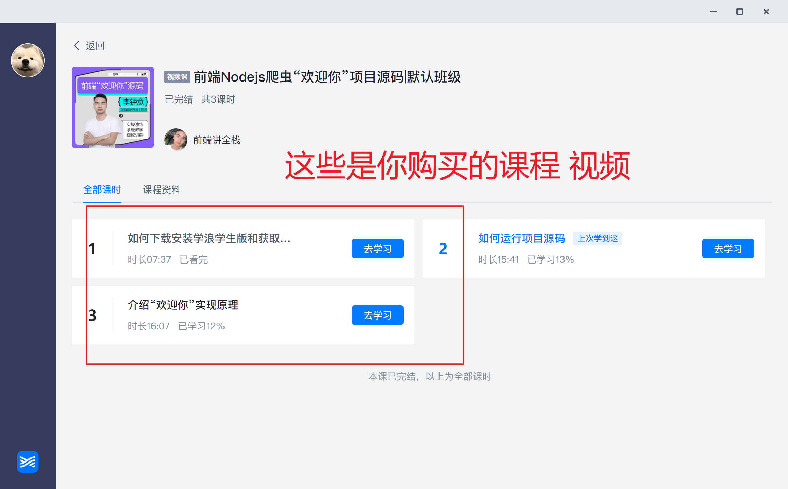

# 获取获取课程资料-视频

## 一、如何下载学浪

1. 浏览器 - [学浪官网 https://www.xuelangapp.com/download](https://www.xuelangapp.com/download)
2. 点击下载学浪
3. 页面滚动到底部
4. 点击下载`学浪学生客户端`(你的电脑是 Windows 就点 `Windows学生客户端`、Mac 就点击 `macOS学生客户端`)
   

## 二、如何安装学浪

1. 打开下载后的文件
2. 双击 `installer-ep_student-1.7.8-release.ep.1-windows.exe`
   

3. 点击开始安装
   

## 三、如何看视频

1. 打开学浪
   

2. 点击`使用抖音授权登录`
   

3. 使用抖音扫码登录
   

4. 登录进来后 找到你购买的课程
   

5. 点击 `去学习`
   

## 四、如何获取课程资料

1. 点击`课程资料`
2. 文档资料

   

