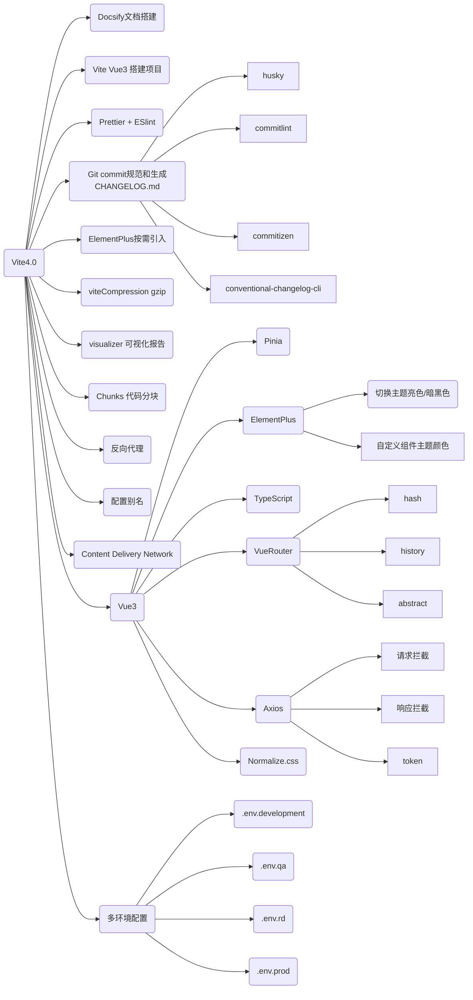
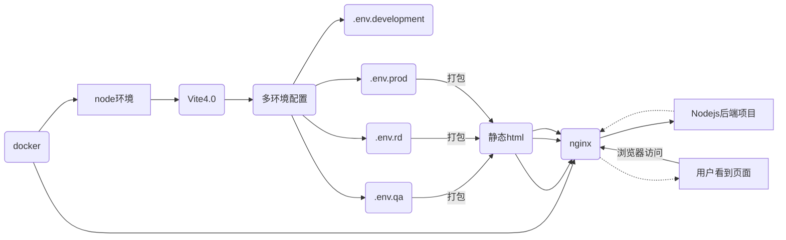
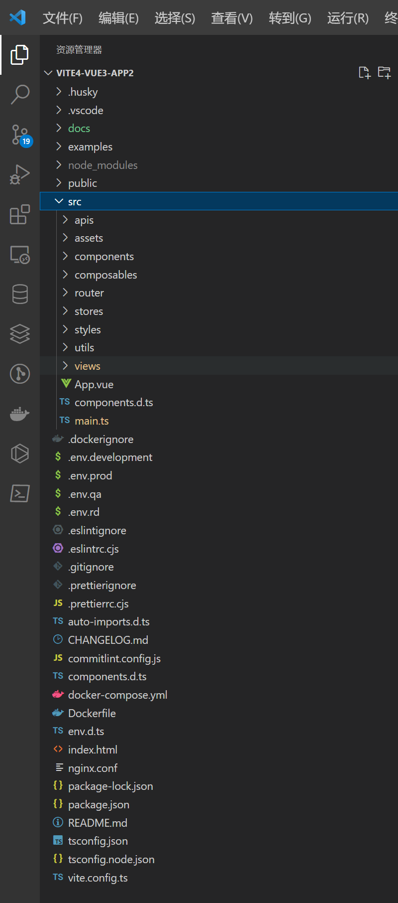
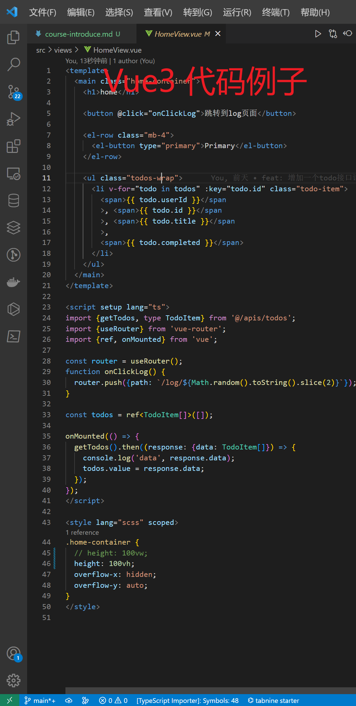

# 课程介绍

## 一、课程大纲

前端 Vite4 + Vue3 项目搭建打包和部署流程图

## 二、如何答疑

1. 直播答疑（[抖音号：前端讲全栈](https://www.douyin.com/user/MS4wLjABAAAAkiur2fK3qQYKHtdnwzT2_ysUpdIbGRMJ_2l3cA_l_3A)）

2. 班级群答疑

## 三、讲师介绍

<!-- ## 四、效果展示

### **最终脚手架效果-暗黑模式**

### **最终脚手架效果-亮色模式**

### **代码目录**

### **HomeView.vue 代码**

### **课程文档**

 -->
